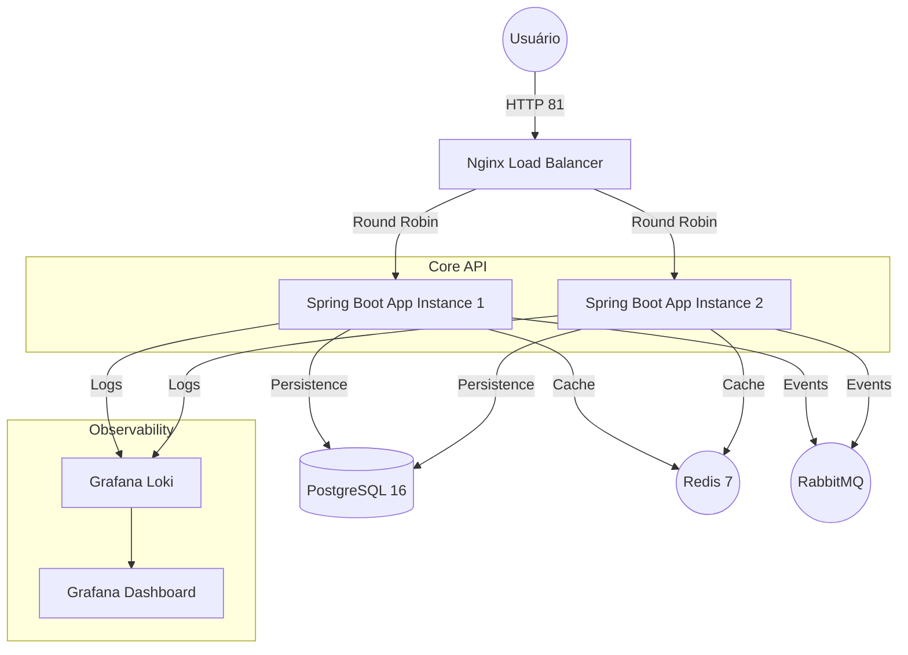

# 📋 Kanban Todo API

Uma API RESTful robusta e de alta performance para gerenciamento de quadros Kanban, construída com **Java 21**, **Spring Boot 3** e aderindo aos princípios de **Clean Architecture**, **Clean Code** e **TDD**.

---

## 🏗️ Visualização da Arquitetura

O diagrama abaixo descreve o fluxo de uma requisição desde o usuário até a infraestrutura de backend, passando pelo balanceamento de carga e serviços de suporte.



---

## 🚀 Tecnologias e Ferramentas

- **Linguagem:** Java 21
- **Framework:** Spring Boot 3.4+
- **Banco de Dados:** PostgreSQL 16 (Relacional)
- **Cache:** Redis (Performance de leitura e redução de carga no banco)
- **Mensageria:** RabbitMQ (Eventos assíncronos para processamento de tarefas)
- **Segurança:** Spring Security + JWT (Stateless Authentication)
- **Documentação:** Swagger/OpenAPI 3.0
- **Observabilidade:** Grafana, Loki (Centralização de Logs)
- **Infraestrutura:** Docker, Docker Compose, Nginx (Load Balancer - Round Robin)

---

## 🏗️ Padrões de Projeto e Arquitetura

O projeto foi construído seguindo a **Clean Architecture**, garantindo que as regras de negócio sejam o núcleo do sistema:
- **Domain:** Entidades puras e lógica de negócio.
- **Application:** Use Cases que orquestram o fluxo de dados.
- **Infrastructure:** Implementações específicas de banco, cache e mensageria.
- **Interfaces:** Controladores REST e tratamento de exceções globais.

---

## 🛠️ Como Executar

### Pré-requisitos
- Docker e Docker Compose instalados.

### Configuração de Ambiente
1. Copie o arquivo de exemplo de ambiente e preencha com suas chaves seguras:
   ```bash
   cp .env.example .env
   ```

### Execução Completa
1. Suba o ambiente completo:
   ```bash
   docker-compose up --build -d
   ```

---

## 📂 Coleções da API

Você pode encontrar arquivos de coleções (YAML) para importar em ferramentas de requisição HTTP (como Insomnia, Postman ou extensões de IDE) na pasta `/collection` na raiz do repositório. Esses arquivos facilitam o teste e a exploração dos endpoints da API.

---

## 📚 Documentação da API (Swagger)

A documentação interativa permite testar todos os endpoints da aplicação.

- **URL Swagger (Produção):** [http://76.13.171.2:8007/swagger-ui/index.html](http://76.13.171.2:8007/swagger-ui/index.html)
- **URL Swagger (Porta da App 1):** [http://localhost:8007/swagger-ui/index.html](http://localhost:8007/swagger-ui/index.html)
- **URL Swagger (Porta da App 2):** [http://localhost:8008/swagger-ui/index.html](http://localhost:8008/swagger-ui/index.html)
- **URL via Nginx (Load Balancer):** [http://localhost:81/swagger-ui/index.html](http://localhost:81/swagger-ui/index.html)

**Nota:** Você também pode baixar as coleções de requisições prontas para testes na pasta `/collection` na raiz do repositório.

**Nota:** Para testar os endpoints protegidos, realize o login via `AuthController` e utilize o Token no botão **"Authorize"** do Swagger.

---

## 📈 Observabilidade e Monitoramento

- **Grafana:** `http://localhost:3001`
  - Acesse dashboards de métricas e logs centralizados.
  - Credenciais padrão definidas no `.env`.
- **Loki:** Centralizador de logs que recebe dados diretamente da aplicação via HTTP.

---

## 🧪 Suíte de Testes (TDD)

O projeto possui **100% de cobertura nos fluxos críticos**. Foram desenvolvidos 57 testes unitários e de integração abrangendo:
- Use Cases (Regras de Negócio)
- Controllers (Validação de Entrada e Respostas HTTP)
- Repositories (Persistência e Ordenação)
- Security (Filtros JWT e Autenticação)

Para rodar os testes localmente:
```bash
./gradlew test
```

---

## 📄 Licença
Este projeto foi desenvolvido como um desafio técnico avançado, demonstrando prontidão para produção (Production-Ready).
